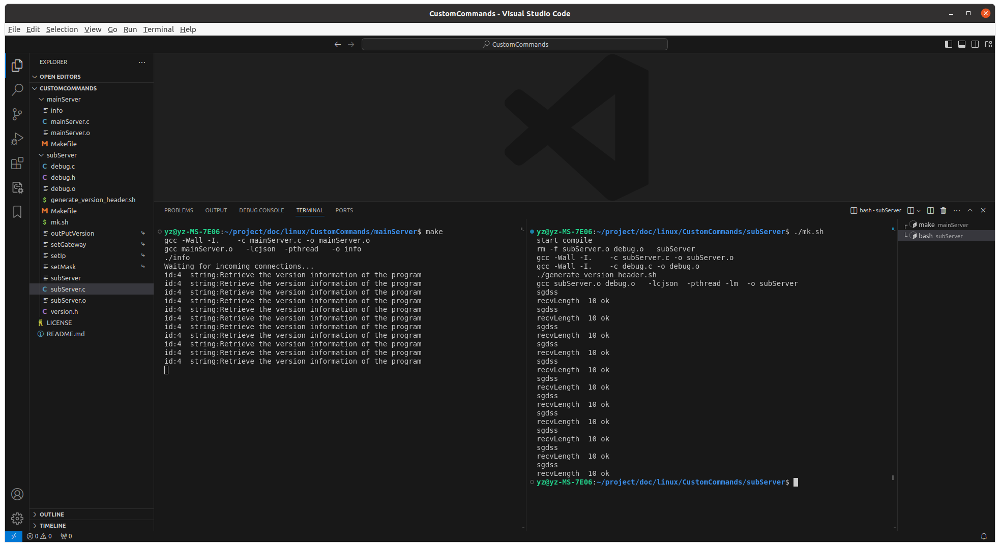

<!--
 * @Author: Your Name you@example.com
 * @Date: 2024-07-13 08:41:36
 * @LastEditors: Your Name you@example.com
 * @LastEditTime: 2024-07-13 08:47:08
 * @FilePath: \undefinede:\linux\CustomCommands\README.md
 * @Description: 这是默认设置,请设置`customMade`, 打开koroFileHeader查看配置 进行设置: https://github.com/OBKoro1/koro1FileHeader/wiki/%E9%85%8D%E7%BD%AE
-->
# CustomCommands
使用进程间的本地socket通信，新增调试接口命令程序，和主进程通信调试功能
### 传递报文格式

```bash
#结构体标识符+json数据报文
typedef struct {
    unsigned short int mark;//固定标识符
    unsigned short int data_length;  // 数据长度
}PacketHeader;
{
	"id":1,	//程序标识符
	"notes":"说明信息"
	//自定义内容
}
```

### 测试界面

